<div align="center">


# Swarm Code

### Your coding agents. Native on the Mac.

<p>
  <a href="https://github.com/soumyachk101/Swarm-Code-Release/releases/latest"></a>
  <a href="https://github.com/soumyachk101/Swarm-Code"></a>
  <a href="LICENSE"></a>
  <a href="https://github.com/soumyachk101/Swarm-Code"></a>
</p>

<p align="center">
  <i>One Liquid Glass window. Your subscriptions. No middleman. No cloud. No compromise.</i>
</p>

</div>

---

## What is Swarm Code?

**Swarm Code** is a native macOS desktop application that unifies AI coding agents into one powerful, beautiful interface.

Built entirely in **Swift and SwiftUI** with Apple's **Liquid Glass** design language, Swarm Code drives the coding agents you already have — on your own subscriptions, with zero markup, zero cloud, zero compromise.

> **Built by [Soumya Chakraborty](https://github.com/soumyachk101). For Mac, only Mac, forever.**

---

## Preview

<p align="center">
  
</p>

<p align="center">
  <sub>Hero · The Liquid Glass window with the assistant composer at the center of attention.</sub>
</p>

---

## Architecture

Swarm Code is a dual-implementation platform with a native macOS frontend and a cross-platform desktop port:

<details>
<summary><b>Native macOS App — Swift / SwiftUI</b></summary>

The primary product. A single Xcode target built with Swift 6, SwiftUI, and the Liquid Glass design language. Uses only one external dependency: SwiftTerm for terminal emulation.

- 100% native SwiftUI with AppKit windowing
- Hardened runtime, signed and notarized
- Apple silicon (arm64) only, macOS 26+
- Four-layer architecture (Core → Services / UI → App)
- Zero telemetry, zero cloud sync, zero analytics
- Direct process spawning for CLI agents (Claude, Codex, Cursor, etc.)
- macOS Keychain for API key storage

</details>

<details>
<summary><b>Cross-Platform Desktop — Electron + TypeScript</b></summary>

A parallel implementation using modern web technologies for broader platform reach:

- **Frontend:** React 19, Svelte 5, TanStack Router, Tailwind CSS v4
- **Backend:** Node.js 22+, Effect-TS for structured concurrency
- **Shell:** Electron 44 for desktop packaging (DMG, EXE, MSI, AppImage)
- **Monorepo:** pnpm workspaces with 10+ internal packages
- **Rust sidecar:** Native resource monitoring via sysinfo

</details>

### Application Architecture (Four-Layer Model)

The SwiftUI app follows a strict dependency hierarchy. The diagram below is rendered as a vector so it never breaks, never falls back to an AI-generated mess, and reads at any zoom level.

<p align="center">
  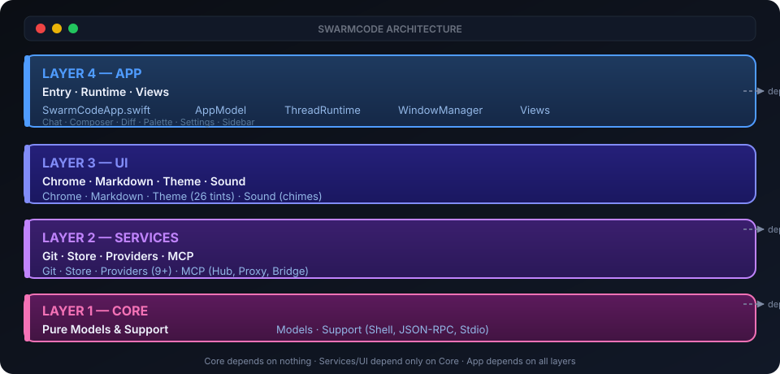
</p>

<p align="center">
  <sub><b>Dependency rule:</b> Core depends on nothing. Services and UI depend only on Core. App depends on all layers.</sub>
</p>

---

### Hydra Multi-Agent System

Hydra is Swarm Code's defining feature — parallel agent delegation with isolated worktrees. The SVG below is drawn from the real flow: one chat, one lead, a brief dispatcher, parallel heads in their own worktrees, and a three-way merge back into the checkout.


<p align="center">
  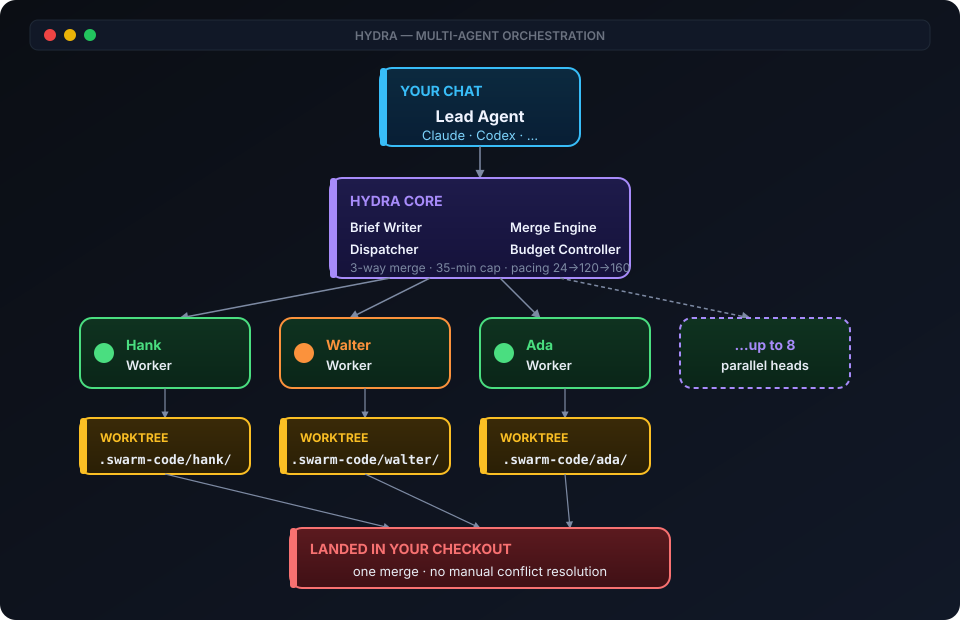
</p>

**How it works:**

1. **Lead** agent receives your task and writes briefs for each head
2. **Dispatcher** launches up to 8 heads in parallel, each in its own git worktree
3. **Heads** execute independently — different models, different providers, different effort levels
4. **Merge Engine** lands their work back as a single merge in your checkout
5. **Budget Controller** paces tool calls (24 pacing → 120 wrap-up → 160 hard stop) and enforces a 35-minute time limit

**Head types:**

- **Native heads:** Run inside the lead's session (Claude's Agent tool, Codex's `spawn_agent`, Copilot's task tool)
- **Swarm-run heads:** Separate sessions launched by Swarm Code, typically when heads use a different provider than the lead

<p align="center">
  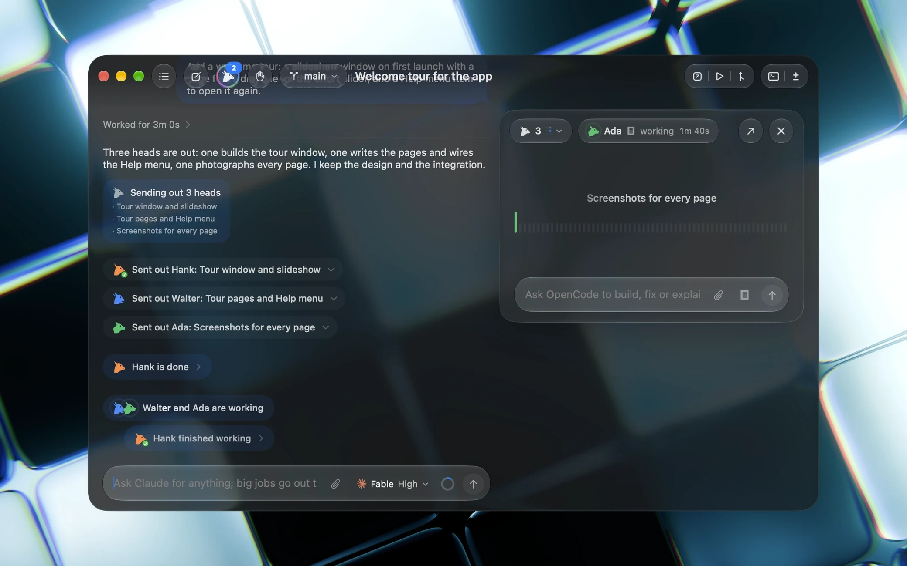
</p>
<p align="center">
  <sub>Hydra heads running in parallel, each in their own worktree, with a brief and live status pane.</sub>
</p>

---

### Provider Ecosystem

Swarm Code abstracts 10+ AI providers behind a unified protocol:

| Provider | Protocol | Auth | Key Feature |
|----------|----------|------|-------------|
| **Claude** (Anthropic) | stream-json + permission prompts | Terminal session | Native agent tools, reasoning effort |
| **Codex** (OpenAI) | App-server JSON-RPC | Terminal session | Banked resets, async task tracking |
| **Cursor** | Agent Client Protocol (ACP) | Terminal session | Plans, todos, permission requests |
| **OpenCode** | Agent Client Protocol (ACP) | Terminal session | Resume cursor versioning |
| **Grok** (xAI) | Agent Client Protocol (ACP) | Terminal session | ACP-based subagents |
| **Antigravity** (Google) | stream-json headless | Terminal session | Sign-in flow, subagent tools |
| **Copilot** (GitHub) | headless JSON-RPC | Terminal session | Custom agents, SDK protocol |
| **Command Code** | NDJSON events + session mod | Terminal session | One run per turn, approval gate |
| **Pi** (Inflection) | JSONL over stdio | Terminal session | Gate extension for approvals |
| **DeepSeek** | Native API (OpenAI-compatible) | API key (Keychain) | Pay-as-you-go credits |
| **Meta** | Native API (Muse Spark) | API key (Keychain) | Direct API at api.meta.ai/v1 |
| **** | Coding Plan API | API key (Keychain) | OpenAI-compatible |

<p align="center">
  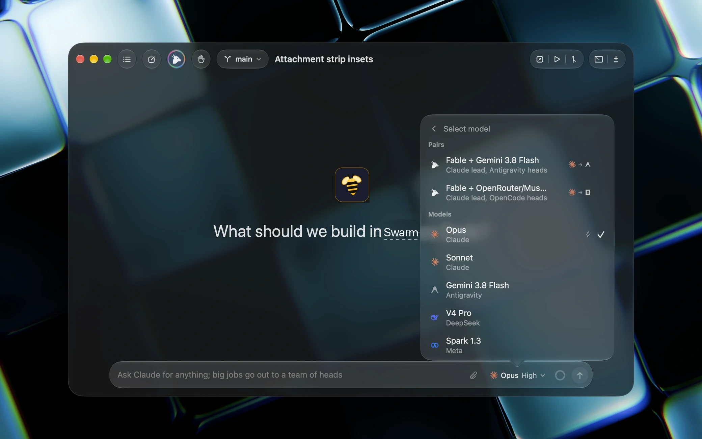
</p>
<p align="center">
  <sub>Live model switching — change provider and model mid-chat without losing context.</sub>
</p>

---

### Data Flow: Request to Response


<p align="center">
  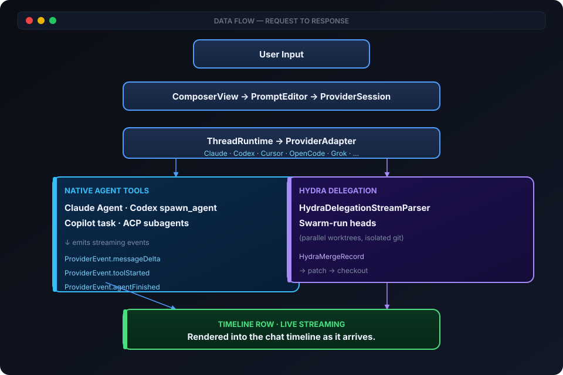
</p>

### MCP Integration

Swarm Code includes a full Model Context Protocol hub:


<p align="center">
  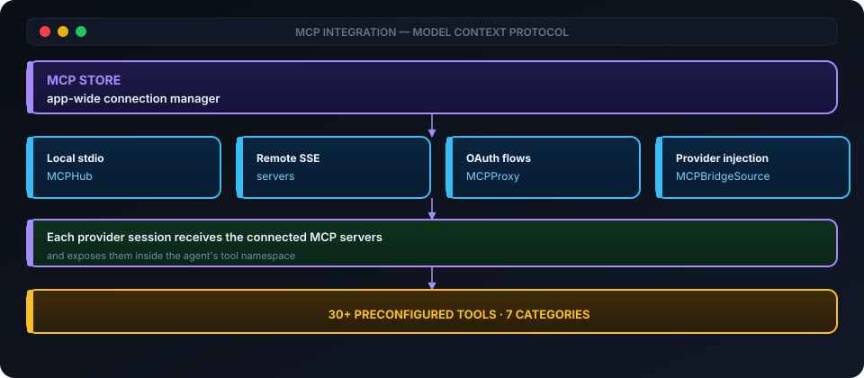
</p>

**30+ preconfigured tools** across Developer, Browser, Search, Work, Data, Cloud, and Knowledge categories.

---

## Features

### Multi-Agent Orchestration

- **Hydra parallel execution** — Lead agent delegates to up to 8 heads in parallel
- **Cross-provider pairs** — Claude lead with Gemini heads, Codex lead with Terra heads
- **Named head profiles** — Purpose-built configurations (quick, deep, visual)
- **Hydra Cookbook** — 9 curated pair recipes with effort presets
- **25 named head personas** — Hank, Walter, Ada, Otto, Nova, Remy, and more
- **Git worktree isolation** — Each head works in its own copy of the project
- **Automatic merging** — Heads' work lands as one merge with conflict handling
- **Live model switching** — Change provider/model mid-chat without losing context

<p align="center">
  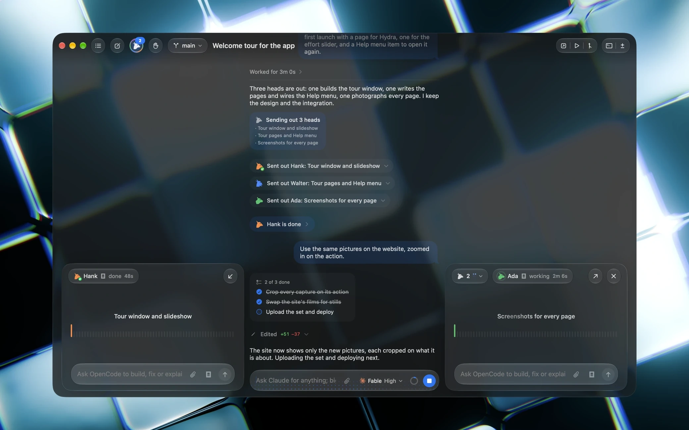
</p>
<p align="center">
  <sub>Named head profiles with curated model and effort presets.</sub>
</p>

### Chat & Threading

- **Projects and threads** in a collapsible sidebar with search
- **Thread modes** — Column, Floating, Panel (animated transitions)
- **Thread pinning, settling, archiving** — Settled threads dim until reopened
- **Follow-up queue** — Type while a turn runs; messages queue and send after
- **Inline approvals** — Agent plans, you approve right in the timeline
- **Reply quotes** — Quote part of a reply to answer in-place
- **Command palette** — ⌘K for threads, projects, actions
- **Keyboard shortcuts** — ⌘1-9 switch threads, ⌘B toggle sidebar, ⌘W archive

<p align="center">
  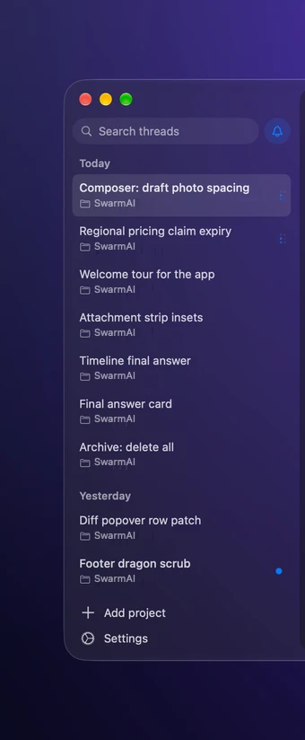
  &nbsp;&nbsp;&nbsp;
  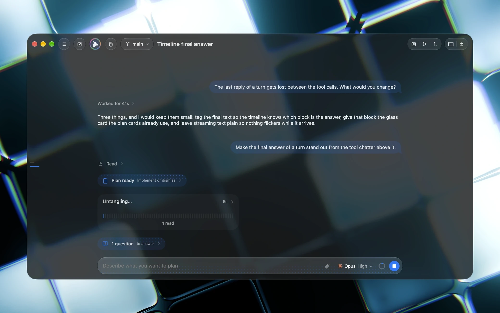
</p>
<p align="center">
  <sub>Sidebar (mobile) and inline agent questions answered right in the timeline.</sub>
</p>

### Diffs & Version History

- **Diff for every turn** — Hidden git checkpoint after each reply
- **Stacked or split diff view** — Choose your preferred layout
- **Diff color schemes** — Red-green or blue-orange
- **Revert any turn** or rewind the whole thread
- **Diff ignore whitespace** toggle

<p align="center">
  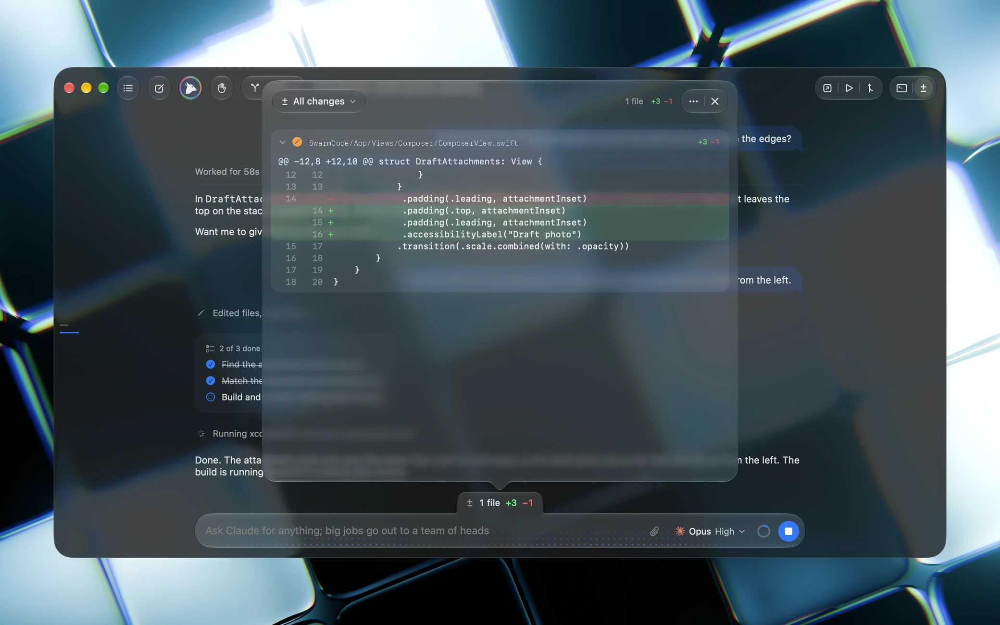
</p>
<p align="center">
  <sub>Stacked diff view with red-green scheme. Revert any turn from the timeline.</sub>
</p>

### Git Integration

- **Automatic worktree creation** — New threads start in isolated worktrees
- **Commit, push, pull requests** — Generated messages and thread titles
- **GitHub, GitLab, Forgejo, Azure DevOps, Bitbucket** hosting support
- **Working tree watch** — Background refresh of remote branches
- **Pull request landing** — Right-click merge in helper thread

<p align="center">
  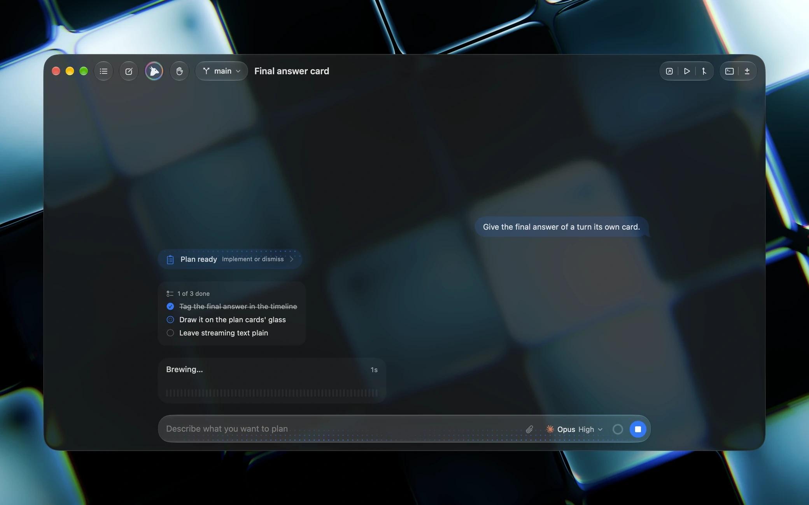
</p>
<p align="center">
  <sub>Agent plans visible inline; approve, reject, or steer before execution.</sub>
</p>

### MCP (Model Context Protocol)

- **Local MCP Hub** — Run stdio and SSE servers from Settings
- **OAuth authentication** — Full OAuth flow with token injection
- **30+ preconfigured tools** — GitHub, Filesystem, Playwright, Brave Search, Slack, Notion, Linear, Figma, Stripe, Supabase, PostgreSQL, Vercel, Cloudflare, Context7, DeepWiki, and more
- **Custom MCP servers** — Add your own with configuration UI

### Themes & Appearance

- **26 tinted-glass themes** — System, Catppuccin, Dracula, Tokyo Night, Nord, Gruvbox, Solarized, GitHub, Matrix, Claude, Codex, and more
- **Custom theme import** — Create and share your own
- **Theme mixing** — Different light/dark theme halves
- **Glass opacity slider** — Control Liquid Glass intensity
- **Appearance contrast** — Fine-tune readability
- **4 font families** — Interface, prompt/composer, code blocks, terminal
- **Per-family font size** — Independent control for each context

<p align="center">
  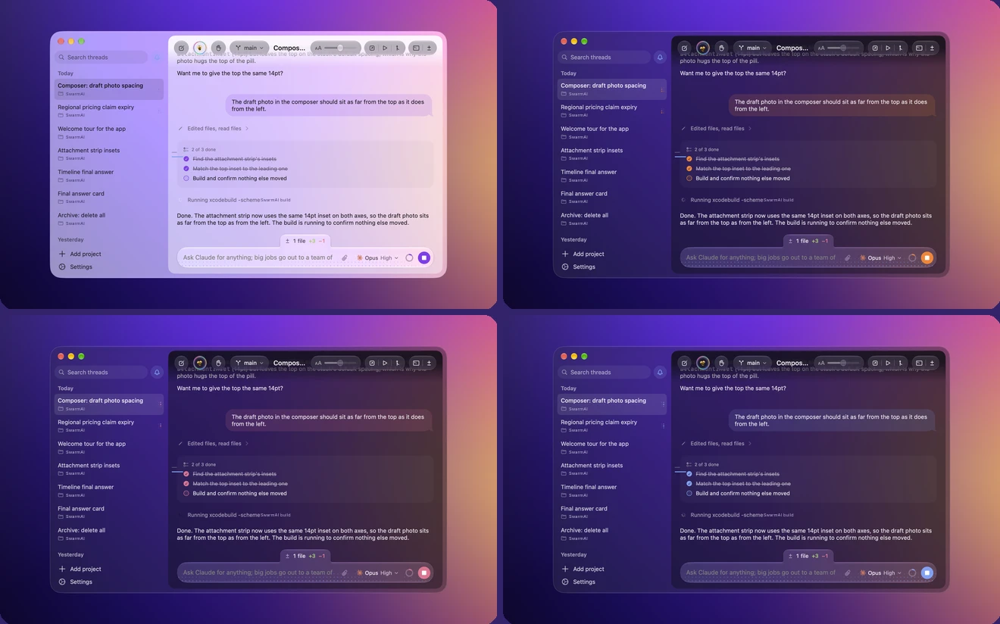
  &nbsp;&nbsp;&nbsp;
  
</p>
<p align="center">
  <sub>26 tinted-glass themes with custom import and theme mixing.</sub>
</p>

### Notifications

- **macOS notification banners** — System-level, breaking through Focus / DND
- **Time-Sensitive priority** — Highest notification level
- **Dock bounce** — When tasks finish while minimized
- **Hydra head completion chimes** — Distinct sounds per head
- **In-app toast banners** — Liquid Glass toast on task completion

### Privacy

- **Zero telemetry** — No analytics, no accounts, no cloud sync
- **No remote access** — No mobile apps, no web client
- **API keys in Keychain** — Never leaves your Mac
- **Direct-origin favicons** — No third-party proxies

---

## Requirements

- Apple Silicon Mac (M1 / M2 / M3 / M4 or newer)
- macOS 26 or later
- At least one provider installed and signed in
- Git, plus `gh` or `glab` for pull requests

## Installation

1. Download `Swarm-Code-<version>.dmg` from the [Releases](https://github.com/soumyachk101/Swarm-Code-Release/releases) page.
2. Double-click the `.dmg` file to open it.
3. Drag **Swarm Code.app** into your `/Applications` folder.
4. Launch from Applications or Spotlight.

> If Gatekeeper blocks it on first launch: right-click → **Open**, or run:
> ```bash
> xattr -cr /Applications/Swarm\ Code.app
> ```

## Building from Source

```bash
# Install dependencies
brew install xcodegen

# Generate Xcode project
xcodegen generate

# Open in Xcode
open SwarmCode.xcodeproj
```

SwiftTerm is the only dependency, fetched by Swift Package Manager. Xcode asks once to trust its build plugin.

## Release Process

```bash
# Build, sign, notarize, and package DMG
scripts/release.sh

# Publish to GitHub Releases
scripts/publish_release.sh
```

## License

MIT. See [LICENSE](LICENSE). The code is free to use; the name "Swarm Code" and its icons are not part of the license, see [TRADEMARK.md](TRADEMARK.md).

---

<div align="center">

**Made with love by [Soumya Chakraborty](https://github.com/soumyachk101)**

Built in Swift. For Mac, only Mac, forever.

[⬆ Back to top](#-swarm-code)

</div>
